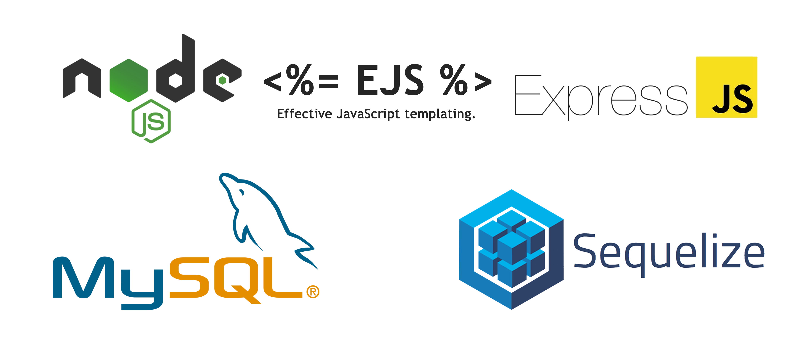

<h2 align="center">Projeto #1 do curso Formação Node.js</h2>
<h4 align="center">Um simples site de perguntas e respostas</h4>

## <strong>Tecnologias utilizadas</strong>
 

 

## <strong>Getting Started</strong>  

1- Instale as dependências do projeto com *npm install* 
2- Instale o MySQL (Server & Workbench) 
3- Crie uma nova database (schema) no MySQL com o nome *guiaperguntas* 
4- Execute o comando *nodemon index.js* para subir o servidor 
 

2021 Leonardo Meira - <strong>Licença: MIT</strong>